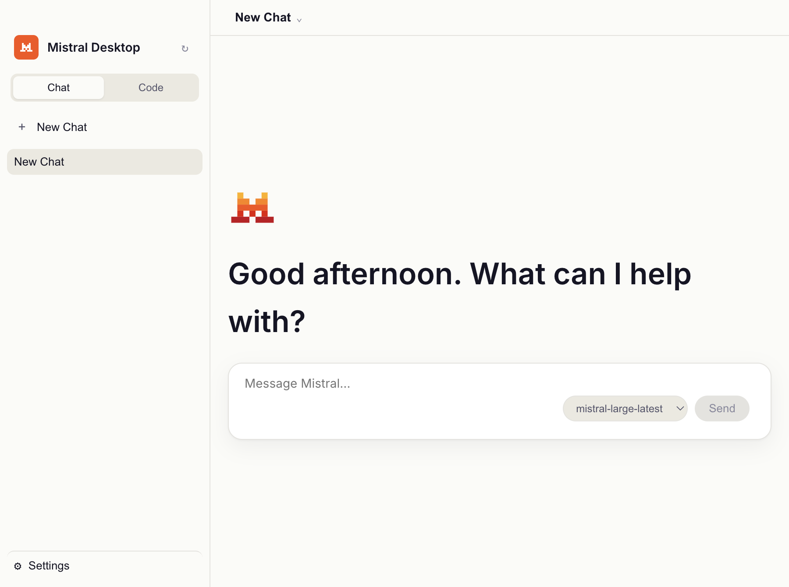
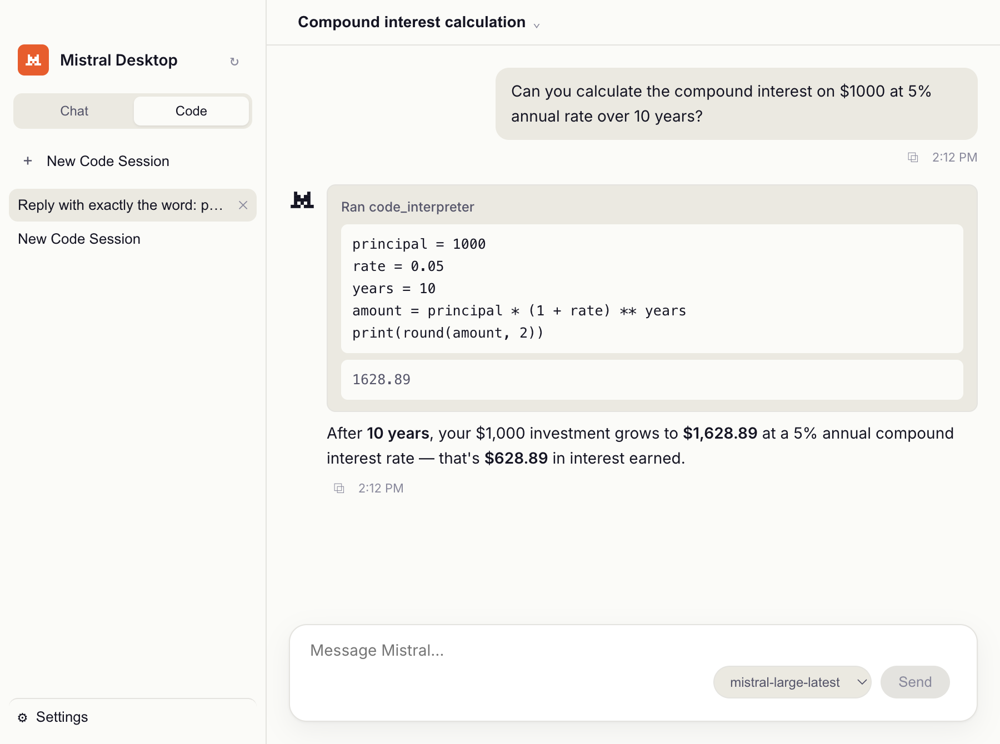

# mistral-desktop

A free, open-source desktop chat client for [Mistral AI](https://mistral.ai), built with Electron.

> **This is an unofficial, community-built project.** It is not affiliated with,
> endorsed by, or sponsored by Mistral AI. "Mistral" and associated logos are
> trademarks of Mistral AI; they're used here under Mistral's public brand
> guidelines, purely to identify which service this app talks to.

**[⬇ Download the latest release](https://github.com/mbfassnacht/mistral-desktop/releases/latest)**
for macOS, Windows, or Linux.

|                    Chat                     |                             Code mode                             |
| :------------------------------------------: | :----------------------------------------------------------------: |
|  |  |

## Download

Prebuilt binaries for macOS, Windows, and Linux are published on the
[Releases page](https://github.com/mbfassnacht/mistral-desktop/releases/latest).
Builds are unsigned, so your OS will show a one-time warning on first launch
(no Apple/Microsoft notarization — see [Contributing](CONTRIBUTING.md) for why).

You'll need your own Mistral API key from [console.mistral.ai](https://console.mistral.ai/)
to use the app. The key is encrypted at rest with your OS keychain
(`safeStorage`) and never leaves your machine.

## Features

- Streaming chat with Mistral's models, per-conversation model/temperature/system-prompt
- **Code mode**: agentic sessions backed by Mistral's Conversations API, with
  `code_interpreter` and `web_search` tools, synced across devices that share
  an API key
- Local conversation history (no server-side account, nothing leaves your machine
  except requests to Mistral's API)
- Markdown rendering for model responses, including GFM tables and code blocks
- Interface available in English, French, Spanish, German, Italian, and Portuguese

## Repository layout

```
src/
  main/       Electron main process - Mistral API calls, API key storage,
              conversation persistence
  preload/    the only bridge between main and renderer
  renderer/   the React UI (sandboxed, no direct Node/Electron access)
  shared/     types used across all three
```

## Development

Requires Node.js 22+ and pnpm (version pinned via `packageManager` in `package.json`).

```bash
pnpm install
pnpm run dev
```

Other useful commands:

```bash
pnpm run typecheck
pnpm run lint
pnpm run build
```

To produce a packaged desktop build for your current platform:

```bash
pnpm run build:mac    # or build:win / build:linux
```

## Contributing

See [CONTRIBUTING.md](CONTRIBUTING.md).

## License

[MIT](LICENSE)
